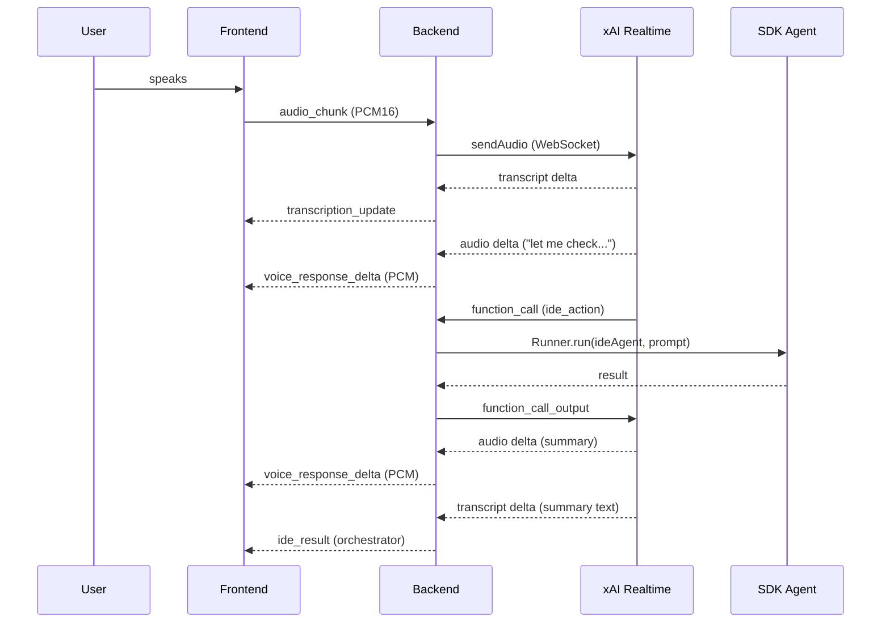

# Feature: Native Orchestrator (Realtime Voice Agent)

Status: completed

Related: [piped-orchestrator-streaming](20260325.piped-orchestrator-streaming.md), [unified-provider-fallback](20260325.unified-provider-fallback.md)

## Summary

Replace the piped STT → SDK Orchestrator → TTS pipeline with a native realtime voice agent that uses the provider's built-in function calling to route and execute tasks. The voice API itself becomes the orchestrator — audio in, tool calls, audio out, all in one WebSocket session.

## Motivation

The current "piped" architecture has three AI hops:

```
Mic → STT transport → transcript → SDK Orchestrator (Chat API) → text → TTS/STS → speaker
```

Providers like xAI Realtime and Gemini Live support function tools natively in their voice sessions. A native orchestrator collapses this to:

```
Mic → Realtime Voice Agent (with function tools) → tool calls + audio → speaker
```

Benefits:
- Single AI call instead of three — dramatically lower end-to-end latency
- Natural voice conversation — the model hears tone, pauses, emphasis
- Barge-in support — user can interrupt mid-response
- The model asks clarifying questions naturally in voice
- Aligns with the project's "agent decisions, not code" principle

## Environment Variables

| Variable       | Values           | Default | Description                                    |
|----------------|------------------|---------|------------------------------------------------|
| `ORCHESTRATOR_TYPE` | `piped`, `native`| `piped` | Orchestrator mode                              |

When `ORCHESTRATOR_TYPE=native`:
- `STT_PROVIDER`, `TTS_PROVIDER` are ignored — the native orchestrator handles all voice I/O
- The provider is determined by `LLM_PROVIDERS` (first provider that supports native mode: `xai` or `gemini`)
- `CODING_CLI`, `IDE_TYPE` still apply — they determine which function tools are registered

When `ORCHESTRATOR_TYPE=piped` (default):
- Current architecture unchanged — voice transports + SDK orchestrator + SDK agents

## Supported Providers

| Provider | Native mode | Notes |
|----------|-------------|-------|
| xAI      | ✅ | Voice Agent API with function tools, `wss://api.x.ai/v1/realtime` |
| Gemini   | ✅ | Live API with function calling, WebSocket bidirectional audio |
| Groq     | ❌ | REST-only APIs, no realtime WebSocket — falls back to piped mode |

If the first provider in `LLM_PROVIDERS` doesn't support native mode, fall back to piped automatically.

## Architecture Comparison

### Piped mode (current)

```
router.ts
  ├── voice/ transports (STT/TTS)
  ├── processWithOrchestrator()
  │     ├── buildAgentGraph()
  │     │     ├── SDK Orchestrator Agent (handoffs)
  │     │     ├── SDK Browser Agent (Playwright MCP)
  │     │     ├── SDK IDE Agent (JetBrains/VS Code MCP + CLI)
  │     │     └── SDK Planner Agent (chat only)
  │     └── Runner.run(orchestrator, transcript)
  └── speakIfEnabled() → TTS
```

### Native mode (new)

```
router.ts
  └── NativeOrchestrator (xAI Realtime / Gemini Live WebSocket)
        ├── System prompt = orchestrator instructions
        ├── Function tools:
        │     ├── run_coding_cli(prompt) → execFile opencode/kiro
        │     ├── browse_web(url, action) → Playwright MCP
        │     ├── ide_action(action, params) → JetBrains/VS Code MCP
        │     └── plan_feature(request) → returns plan text
        ├── Audio in → VAD → model processes → function calls → audio out
        └── Emits: transcription_update, ide_result, voice_response_delta, voice_response_done
```

## File Structure

```
backend/src/agents/
├── orchestrator/               # SDK Agent (piped mode) — unchanged
│   ├── index.ts
│   └── instructions.ts
├── orchestrator-native/        # Realtime voice agent (native mode)
│   ├── index.ts                # createNativeOrchestrator() factory, NativeOrchestrator interface
│   ├── instructions.ts         # Adapted orchestrator prompt for native mode (no handoffs, uses tool names)
│   ├── tools.ts                # Function tool JSON schemas for realtime API registration
│   ├── tool-executor.ts        # Executes tool calls: routes to CLI, MCP, or planner
│   ├── xai.ts                  # xAI Realtime implementation
│   └── gemini.ts               # Gemini Live implementation (future)
```

## Interface Design

```typescript
export type TranscriptCallback = (transcript: string) => void;
export type AudioChunkCallback = (base64Audio: string) => void;
export type AudioDoneCallback = () => void;
export type ToolResultCallback = (agent: string, status: string, message: string) => void;
export type StatusCallback = (status: string) => void;
export type ErrorCallback = (error: string) => void;

export interface NativeOrchestrator {
  connect(): Promise<void>;
  sendAudio(base64: string): void;
  sendText(text: string): void;
  close(): void;
  isConnected(): boolean;

  setCallbacks(
    onTranscript: TranscriptCallback,
    onAudioChunk: AudioChunkCallback,
    onAudioDone: AudioDoneCallback,
    onToolResult: ToolResultCallback,
    onStatus: StatusCallback,
    onError: ErrorCallback,
  ): void;
}
```

Key differences from `STSTransport`:
- No `speak(text)` — the model generates audio responses itself
- `sendText(text)` — for manual text prompts (injected as `conversation.item.create`)
- `onToolResult` — emits results from function tool executions (for UI display)

## Function Tools

The native orchestrator registers these as function tools on the realtime session:

### `run_coding_cli`
- Description: Execute a coding task via CLI (opencode or kiro)
- Parameters: `{ prompt: string, continueSession?: boolean }`
- Execution: Reuses existing `execFile` logic from `ide/tools/opencode.ts` and `ide/tools/kiro.ts`
- Only registered when `CODING_CLI !== 'none'`

### `ide_action`
- Description: Perform an IDE action (open file, search, navigate, read, build)
- Parameters: `{ action: string, params: object }`
- Execution: Calls JetBrains/VS Code MCP server tools
- Only registered when `IDE_TYPE !== 'none'`
- Actions map to MCP tool names: `open_file_in_editor`, `search_in_files_by_text`, `get_file_text_by_path`, `build_project`, etc.

### `browse_web`
- Description: Browse a webpage, search the web, interact with a page
- Parameters: `{ prompt: string }`
- Execution: Calls Playwright MCP server tools (browser_navigate, browser_snapshot, browser_click, etc.)
- Note: This is a simplified interface — the native model decides what browser actions to take based on the prompt, then we execute via MCP. Alternatively, register individual Playwright MCP tools directly.

### `plan_feature`
- Description: Design an implementation plan for a complex feature
- Parameters: `{ request: string }`
- Execution: Runs the planner agent via SDK `Runner.run()` and returns the plan text
- The native orchestrator speaks a summary; the full plan is emitted via `onToolResult` for UI display

## Prompt Adaptation

The native orchestrator prompt is adapted from `orchestrator/instructions.ts` but with key changes:

- No "hand off to Agent X" — instead "call the `tool_name` function tool"
- Routing rules map to tool names instead of agent names:
  - Browser requests → call `browse_web`
  - IDE/coding requests → call `run_coding_cli` or `ide_action`
  - Planning requests → call `plan_feature`
  - Greetings/chitchat → respond directly (voice)
- Includes AGENTS.md context for project awareness
- Includes voice-specific instructions: "speak concisely", "don't use markdown", "don't use emojis"

## Router Wiring

In `router.ts`, the `start_transcription_stream` handler branches:

```
if ORCHESTRATOR_TYPE === 'native' && provider supports it:
  nativeOrch = createNativeOrchestrator(provider, apiKey, sid, { ideType, codingCli })
  nativeOrch.setCallbacks(
    onTranscript  → emit transcription_update + add to session
    onAudioChunk  → emit voice_response_delta
    onAudioDone   → emit voice_response_done
    onToolResult  → emit ide_result / browser_result + add to session
    onStatus      → emit status
    onError       → emit error
  )
  nativeOrch.connect()
  nativeClients.set(sid, nativeOrch)
else:
  // existing piped mode (STT + TTS/STS + processWithOrchestrator)
```

The `manual_prompt` handler:
```
if nativeClients.has(sid):
  nativeClients.get(sid).sendText(text)
else:
  processWithOrchestrator(text, sid, io)
```

Audio/cleanup handlers follow the same pattern as STS — check `nativeClients` map first.

## xAI Implementation Detail

`orchestrator-native/xai.ts`:

- WebSocket to `wss://api.x.ai/v1/realtime` (global endpoint, not regional — regional lacks audio output)
- Session config includes:
  - `voice`: configurable (default "Sal")
  - `instructions`: native orchestrator prompt
  - `turn_detection`: `server_vad`
  - `audio.input/output`: PCM 24kHz
  - `tools`: array of function tool definitions (JSON schemas)
- On `response.function_call_arguments.done`:
  1. Parse function name + arguments
  2. Execute via `tool-executor.ts`
  3. Send `conversation.item.create` with `function_call_output`
  4. Send `response.create` to continue
- On `response.output_audio.delta` → emit audio chunks
- On `conversation.item.added` (user) → emit transcript
- Handles parallel tool calls: collect all `function_call_arguments.done` events, execute all, send all outputs, then single `response.create`

## What Changes vs Piped Mode

| Aspect | Piped | Native |
|--------|-------|--------|
| STT | Separate transport | Built into realtime session |
| Orchestrator | SDK Agent (Chat API) | Realtime model with function tools |
| Tool execution | SDK Agent handoffs → sub-agents | SDK Agents via `Runner.run()` (same quality) |
| TTS | Separate transport or STS | Built into realtime session |
| Provider rotation | ✅ Multiple providers | ❌ Single provider per session |
| SDK guardrails | ✅ InputGuardrail | ❌ Must be in system prompt |
| SDK session/history | ✅ Managed by SDK | ❌ Managed by realtime API internally |
| Text-only input | Chat API (efficient) | Injected into realtime session (works but wasteful) |
| Latency | ~3-5s (3 AI hops) | ~1-2s (1 AI hop) |

## Scope Boundaries

- xAI implementation first, Gemini Live follows the same pattern
- Piped mode remains the default and is fully unchanged
- When mic is off and user only types, native mode still uses the realtime session (via `sendText`)
- No frontend changes needed — same socket events
- Extension agents: extensions register additional function tools via `tools.ts`

## Sequence Diagram



## Implementation Plan

- [x] **Step 1: Define NativeOrchestrator interface**
  - [x] Create `backend/src/agents/orchestrator-native/index.ts`
  - [x] Define `NativeOrchestrator` interface
  - [x] Define callback types
  - [x] Export `createNativeOrchestrator()` factory

- [x] **Step 2: Define function tool schemas**
  - [x] Create `backend/src/agents/orchestrator-native/tools.ts`
  - [x] Define JSON schemas for `run_coding_cli`, `ide_action`, `browse_web`, `plan_feature`
  - [x] Conditionally include tools based on `IDE_TYPE` and `CODING_CLI`

- [x] **Step 3: Implement tool executor**
  - [x] Create `backend/src/agents/orchestrator-native/tool-executor.ts`
  - [x] Route `run_coding_cli` → existing `execFile` wrapper logic
  - [x] Route `ide_action` → `Runner.run(ideAgent, prompt)` — full SDK IDE Agent with MCP + CLI
  - [x] Route `browse_web` → `Runner.run(browserAgent, prompt)` — full SDK Browser Agent with Playwright MCP
  - [x] Route `plan_feature` → `Runner.run(plannerAgent, request)` — full SDK Planner Agent

- [x] **Step 4: Adapt orchestrator prompt**
  - [x] Create `backend/src/agents/orchestrator-native/instructions.ts`
  - [x] Adapt routing rules: agent names → tool names
  - [x] Add voice-specific instructions (concise, no markdown, no emojis)
  - [x] Include AGENTS.md context
  - [ ] Support `InstructionParts` for extensions (deferred — extensions can add tools later)

- [x] **Step 5: Implement xAI native orchestrator**
  - [x] Create `backend/src/agents/orchestrator-native/xai.ts`
  - [x] WebSocket connection to `wss://api.x.ai/v1/realtime` (global endpoint) with function tools in session config
  - [x] Handle `response.function_call_arguments.done` → execute via `Runner.run()` → send output → `response.create`
  - [x] Handle parallel tool calls (collect all on `response.done`, execute all, then continue)
  - [x] Handle audio deltas, transcripts, errors
  - [x] Handle `sendText()` via `conversation.item.create`
  - [x] Audio queuing: frontend schedules PCM buffers sequentially via `pcmNextTimeRef`
  - [x] Clean MCP JSON unwrapping for UI display of tool results
  - [x] Separate `pcmContextRef` for playback (not shared with mic `audioContextRef`)

- [x] **Step 6: Wire into router**
  - [x] Add `ORCHESTRATOR_TYPE` env var check
  - [x] Add `nativeClients` map
  - [x] Branch `start_transcription_stream`: native vs piped
  - [x] Branch `manual_prompt`: native `sendText()` vs `processWithOrchestrator()`
  - [x] Branch `audio_chunk`, cleanup handlers
  - [x] Auto-fallback to piped if provider doesn't support native

- [x] **Step 7: Update config and settings**
  - [x] Add `ORCHESTRATOR_TYPE` to `getSettingsSnapshot()`, settings allowed keys, `.env.example`
  - [x] Add `ORCHESTRATOR_TYPE` to Settings UI dropdown
  - [x] Update AGENTS.md env vars table

- [x] **Step 8: Update AGENTS.md architecture section**
  - [x] Add `ORCHESTRATOR_TYPE` to env vars table
  - [x] Add AGENTS.md to piped orchestrator prompt (was missing)

## Testing

1. Set `ORCHESTRATOR_TYPE=native`, `LLM_PROVIDERS=xai`, start backend
2. Speak "hello" → verify voice response (no tool call)
3. Speak "open main.ts" → verify `ide_action` tool call + voice confirmation
4. Speak "search the web for Node.js 22 release" → verify `browse_web` tool call
5. Type a text prompt → verify it's processed via `sendText()`
6. Set `ORCHESTRATOR_TYPE=piped` → verify current architecture works unchanged
7. Set `ORCHESTRATOR_TYPE=native`, `LLM_PROVIDERS=groq` → verify auto-fallback to piped
