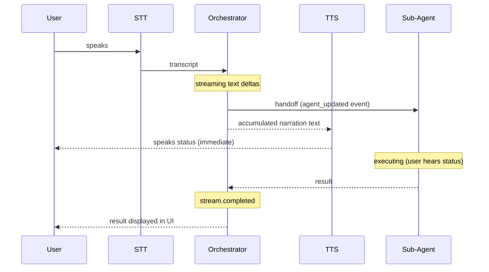

# Feature: Piped Orchestrator Streaming

Status: draft

Related: [orchestrator-native](20260325.orchestrator-native.md)

Use SDK streaming (`{ stream: true }`) in piped mode to speak the orchestrator's status message BEFORE the sub-agent executes.

## Current Behavior

`Runner.run()` executes the full chain synchronously — orchestrator → handoff → sub-agent → result. The orchestrator's narration ("Let me search the web...") is only spoken after the entire chain completes.

## Desired Behavior

```
User speaks → STT → Orchestrator streams → speaks "Let me search for that" (immediate)
  → Handoff to Browser Agent (user hears status while waiting)
  → Browser Agent completes → result displayed in UI
```

## Technical Approach

Use `run(agent, input, { stream: true })` and listen to stream events:

1. Accumulate orchestrator text from `raw_model_stream_event` deltas while current agent is Orchestrator
2. On `agent_updated_stream_event` (agent switches) — speak accumulated text via TTS immediately
3. After `stream.completed` — handle final output same as before (display in UI, no TTS for sub-agent output)

## Sequence Diagram



## Implementation Plan

- [ ] **Step 1: Switch to streaming mode**
  - [ ] Replace `new Runner().run(...)` with `new Runner().run(..., { stream: true })`
  - [ ] Accumulate orchestrator text from `raw_model_stream_event` while agent is Orchestrator
  - [ ] On `agent_updated_stream_event` — speak accumulated text, emit to UI
  - [ ] Await `result.completed` after event loop
  - [ ] Use `result.finalOutput` and `result.lastAgent` for post-completion handling (unchanged)

- [ ] **Step 2: Preserve error handling and provider rotation**
  - [ ] Wrap streaming in same try/catch with `isRetryable` + `rotateProvider`
  - [ ] Ensure abort signal still works

## Testing

1. Piped mode: speak "search the web for weather" → hear status before browser executes
2. Piped mode: speak "hello" (no handoff) → orchestrator responds normally
3. Native mode: unchanged behavior
4. Provider rotation: still works on error
5. Stop command: still interrupts
