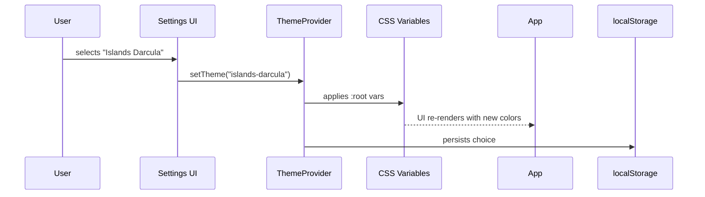

# Feature: UI Themes

Status: completed

## Summary

Add a theming system to the frontend using CSS custom properties. Extract all hardcoded colors into theme files. Ship two themes: Darcula (current look) and Islands Darcula (matching JetBrains IDEA Islands Darcula).

## Sequence Diagram

## Color Palettes

### Darcula (current)
- Background: `#242628`
- Sidebar: `#3c3f41`
- Border: `#323232`
- Text primary: `#a9b7c6`
- Text secondary: `#aaa`
- Accent green: `#6a8759`
- Error red: `#f44336`
- Status blue: `#2196f3`
- Status amber: `#ffc107`

### Islands Darcula (new)
- Background: `#1e1f22`
- Sidebar: `#2b2d30`
- Border: `#393b40`
- Text primary: `#bcbec4`
- Text secondary: `#6f737a`
- Accent blue: `#4a88c7`
- Selection: `#2d5f8a`
- Error red: `#f44336`
- Status blue: `#3574f0`
- Status amber: `#e6a835`

## Implementation Plan

- [x] **Step 1: Create theme files**
  - [x] Create `frontend/src/themes/darcula.css` — CSS custom properties for current colors
  - [x] Create `frontend/src/themes/islands-darcula.css` — CSS custom properties for Islands palette
  - [x] Create `frontend/src/themes/index.js` — theme registry and `applyTheme(name)` function

- [x] **Step 2: Replace hardcoded colors in App.css**
  - [x] Extract all color values into `var(--theme-*)` custom properties
  - [x] Set Darcula as default theme (`:root` fallback)

- [x] **Step 3: Add theme selector to Settings UI**
  - [x] Add theme dropdown to Settings page
  - [x] Persist selection in localStorage
  - [x] Apply theme on page load

- [x] **Step 4: Clean up index.css**
  - [x] Replace hardcoded colors with theme variables

## Testing

1. Default load → Darcula theme (matches current look exactly)
2. Switch to Islands Darcula → colors update immediately
3. Refresh page → persisted theme restored
4. All UI elements readable in both themes
