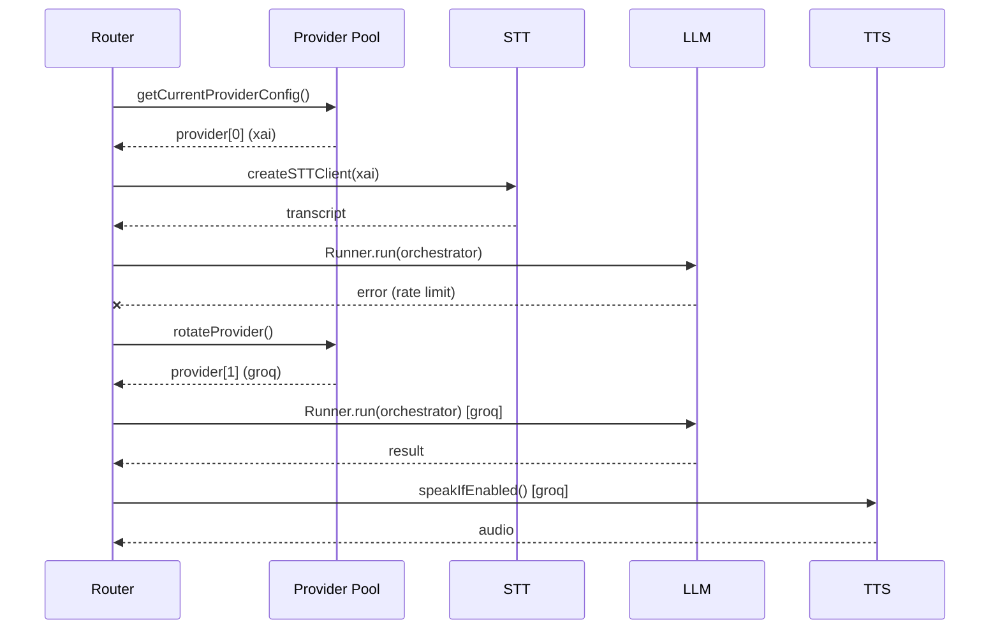

# Feature: Unified Provider Fallback

Status: completed

Related: [orchestrator-native](20260325.orchestrator-native.md)

Remove separate `STT_PROVIDER`, `TTS_PROVIDER` env vars. All capabilities (STT, TTS, LLM, native/STS) come from `LLM_PROVIDERS` with automatic fallback rotation. One provider list, one fallback chain.

## Current Architecture

```
LLM_PROVIDERS=xai,groq       → LLM + orchestrator fallback
STT_PROVIDER=xai              → speech-to-text (separate setting)
TTS_PROVIDER=gemini            → text-to-speech (separate setting)
ORCHESTRATOR_TYPE=native|piped → native uses first LLM provider implicitly
```

Problems:
- 4 separate provider settings, confusing
- Native mode silently picks provider from `LLM_PROVIDERS` — implicit
- STT/TTS providers don't participate in fallback rotation
- If xAI STT fails, no automatic fallback to groq STT

## Proposed Architecture

```
LLM_PROVIDERS=xai,groq,gemini   → everything: LLM, STT, TTS, native
ORCHESTRATOR_TYPE=native|piped   → mode selection
```

### Provider Capabilities

| Provider | STT | TTS | Native (STS) | LLM |
|----------|-----|-----|--------------|-----|
| xai      | ✅  | ✅  | ✅           | ✅  |
| groq     | ✅  | ✅  | ❌           | ✅  |
| gemini   | ✅  | ✅  | ❌           | ✅  |

### Fallback Algorithm

One shared `global_index` into `LLM_PROVIDERS`. Any STT/LLM/TTS failure advances it. Native failure does NOT rotate — it switches to piped with the same provider.

**Session start with `ORCHESTRATOR_TYPE=native`:**
```
provider = LLM_PROVIDERS[global_index]

if supportsNative(provider):
  try STS(native)(provider) → success? use native mode
    LLM calls (sub-agents) use provider at global_index (rotates on failure)
    TTS not needed (native speaks directly)
  
  STS(native) fails → switch to piped (same provider, no rotation):
    STT(provider) → fail? rotate global_index, retry STT
    LLM(provider) → fail? rotate global_index, retry LLM
    TTS(provider at global_index) → fail? rotate, retry TTS

else (provider doesn't support native):
  fall through to piped:
    STT(provider) → fail? rotate global_index, retry STT
    LLM(provider) → fail? rotate global_index, retry LLM
    TTS(provider at global_index) → fail? rotate, retry TTS
```

**Session start with `ORCHESTRATOR_TYPE=piped`:**
```
provider = LLM_PROVIDERS[global_index]

STT(provider) → fail? rotate global_index, retry STT
LLM(provider at global_index) → fail? rotate global_index, retry LLM
TTS(provider at global_index) → fail? rotate, retry TTS
```

**Key rules:**
- One shared `global_index`, starts at 0
- Any STT/LLM/TTS failure advances `global_index` and retries with next provider
- Native failure does NOT advance index — just switches to piped with same provider
- Downstream calls always use current `global_index` (cascading)
- All providers exhausted → error to UI

## Env Vars Removed

- `STT_PROVIDER` — replaced by first available provider in `LLM_PROVIDERS`
- `TTS_PROVIDER` — replaced by first available provider in `LLM_PROVIDERS`
- `TTS_MAX_LENGTH` — keep as-is (it's a behavior setting, not a provider setting)

## Sequence Diagram



## Implementation Plan

- [x] **Step 1: Refactor provider pool for shared rotation**
  - [x] Add `supportsNative()` to `core/providers.ts` (uses current provider)
  - [x] Add `getCurrentProviderConfig()` export
  - [x] Existing `rotateProvider()` already advances global index — reused as-is

- [x] **Step 2: Update voice client factories**
  - [x] `createSTTClient()` — use current provider from global index instead of `STT_PROVIDER`
  - [x] `createTTSClient()` — use current provider from global index instead of `TTS_PROVIDER`
  - [x] Add retry wrapper: on error → `rotateProvider()` → recreate client → retry

- [x] **Step 3: Update router for unified fallback**
  - [x] STT/TTS use `getCurrentProviderConfig()` instead of separate env vars
  - [x] Native mode uses `getCurrentProviderConfig()` instead of parsing `LLM_PROVIDERS`
  - [x] STT failure → `rotateProvider()`, recreate STT client, retry
  - [x] TTS failure → `rotateProvider()`, recreate TTS client, retry
  - [x] LLM failure (existing) → `rotateProvider()`, retry SDK run

- [x] **Step 4: Update native orchestrator fallback**
  - [x] On native WebSocket error: do NOT rotate — switch to piped with same provider
  - [x] On native connect failure: fall back to piped with same provider

- [x] **Step 5: Clean up config and settings**
  - [x] Remove `STT_PROVIDER`, `TTS_PROVIDER` from `config.ts`, `settings.ts`, `.env.example`
  - [x] Remove from Settings UI dropdowns
  - [x] Update AGENTS.md env vars table

- [x] **Step 6: Update documentation**
  - [x] Update AGENTS.md
  - [x] Update README.md configuration table

## Testing

1. `LLM_PROVIDERS=xai` — native works, piped works
2. `LLM_PROVIDERS=groq` — native skipped (unsupported), piped works with groq STT/TTS
3. `LLM_PROVIDERS=xai,groq` — xAI native, on failure falls to xAI piped, on failure falls to groq piped
4. Kill xAI API mid-session → verify rotation to groq with new STT/TTS clients
5. `LLM_PROVIDERS=gemini` — piped works with gemini STT/TTS/LLM
